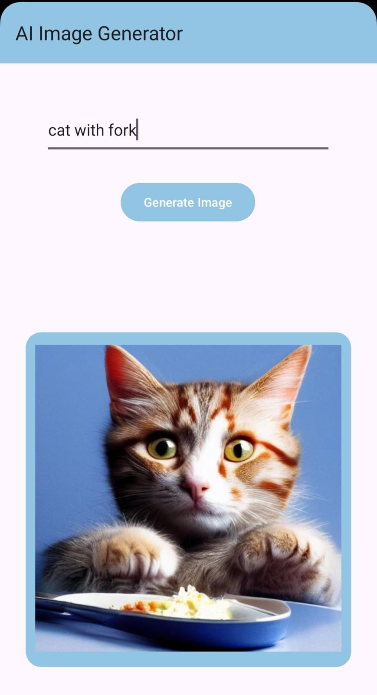

# AI Image app
Simple Android app in java that uses Stable Horde Api to generate images given a prompt (Uncensored)

# 📱 App



This app is a simple page with a text box, an image box and a button. To use the AI you simply type the prompt in the text box and click the button. Nsfw images require much more time to generate compared to Sfw images. 

The api used is Stable Horde Api, you can get a key for free [here](https://stablehorde.net/), and [here](https://stablehorde.net/api/) are all the api calls.

# 💻 Code


### - Setup

The code is quite simple, first in MainActivity all the resources/plugins/icon/progress bar/banners are loaded, then the main Button listener is created, its logic is in ```StableHordeClient.java``` file, as well as the rest of the code.

### - Api implementation

The api logic is displayed in the ```StableHordeClient.java``` file: the first api call is used to make a request to generate an image, the full list if parameters is available on Stable Horde website. Keep in mind that the more parameters you use, the more time the stable diffusion model will need to generate an image, especially for nsfw images for some reason...

The response to this call is a task id that is then used to get the link to the image. Every 10 seconds the code will check the link to see if the image is generated, if an image is found, it will be mapped and displayed into the Image Box, else the website will most likely display an error, which is then shown to the user via a Toast android box.
